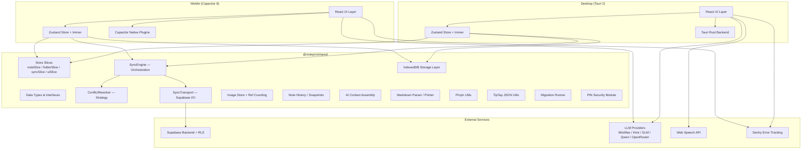
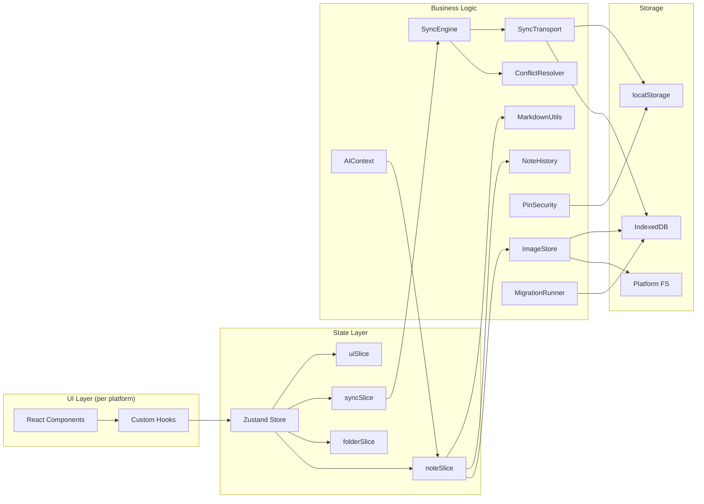
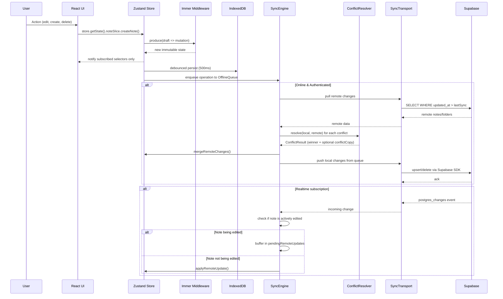
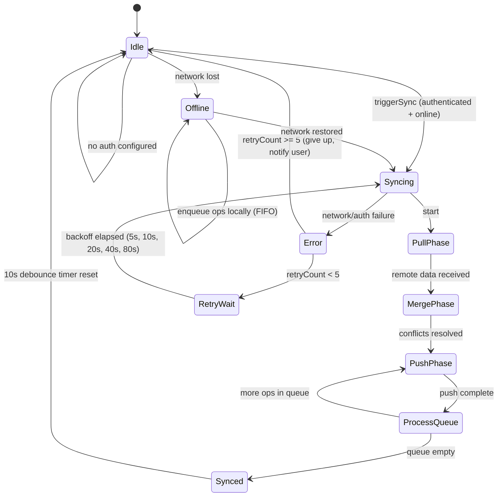
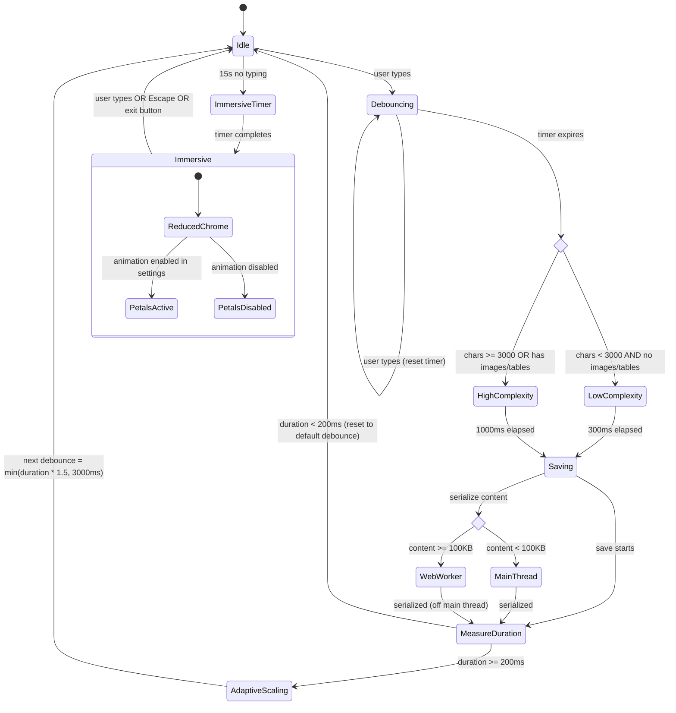

# Design Document

## Overview

Shimo (拾墨) is a cross-platform note-taking application built on a shared TypeScript library (`@notepro/shared`) consumed by Desktop (Tauri 2) and Mobile (Capacitor 8) frontends. The architecture follows an offline-first, event-driven pattern where all business logic lives in the shared package and platform-specific code handles only native shell integration.

The system provides rich-text editing via TipTap 3 (ProseMirror), tag-based organization with D3 force-directed graph visualization, cloud sync via Supabase with last-write-wins conflict resolution and explicit conflict copy creation, AI-assisted writing through OpenAI-compatible Chinese LLM providers, PIN-based security with PBKDF2 hashing (100K iterations), and comprehensive import/export capabilities.

### Key Design Decisions

1. **Zustand with Immer middleware + atomic selectors**: State management uses Zustand stores with Immer middleware for immutable updates. A slice-based architecture (noteSlice, folderSlice, syncSlice, uiSlice) groups 26+ action types into logical domains. `subscribeWithSelector` middleware enables atomic selectors — components subscribe to exactly the data they need, preventing unnecessary re-renders even with 500+ notes in the store. This replaces the previous Context + useReducer approach to eliminate the "single context = full tree re-render" problem.

2. **Offline-first with eventual sync**: IndexedDB is the primary data store. Supabase sync is opportunistic — the app is fully functional without network. An offline operation queue captures ALL mutations (create, update, delete) for ordered replay on reconnect.

3. **Content as stringified TipTap JSON**: Note content is stored as a JSON string representing the ProseMirror document tree. This enables rich-text editing while keeping the storage layer format-agnostic.

4. **Platform-native image storage with reference counting**: Images larger than 100KB are stored outside IndexedDB using platform-native filesystem APIs (Tauri FS / Capacitor Filesystem), referenced via `asset://local/{id}.{ext}` URIs in the TipTap JSON. Images exceeding 5MB are compressed to 2MB at 80% quality. Reference counting enables orphan cleanup when notes are permanently deleted.

5. **No router**: Navigation is state-driven via boolean flags and active IDs. Modal overlays handle all secondary views (settings, tag graph, AI panel, etc.).

6. **Three-layer sync architecture**: SyncEngine (orchestration) → ConflictResolver (strategy, swappable) → SyncTransport (Supabase I/O). This separation enables future migration from LWW to CRDT-based merge (e.g., Yjs) without changing the sync protocol or storage schema.

7. **Adaptive debounce**: Editor saves use complexity-aware debouncing (300ms for simple notes, 1000ms for complex ones) with dynamic scaling (1.5x) based on measured save duration, capped at 3000ms.

8. **Large note serialization offloading**: Notes exceeding 100KB of serialized TipTap JSON are serialized in a Web Worker to avoid blocking the main thread during saves.

## Architecture

### High-Level Architecture



### Module Dependency Graph



### Data Flow



### Sync Engine State Machine



### Editor Save State Machine



## Components and Interfaces

### State Management — Zustand with Immer + Slices

The store uses Zustand with `immer` middleware for immutable updates and `subscribeWithSelector` for atomic subscriptions. The store is split into four slices to organize the 26+ action types:

```typescript
// Shared/src/lib/store/types.ts

import type { Note, Folder, ThemeMode } from '../../types';

/** Sync engine state exposed to UI */
export type SyncStatus = 'idle' | 'syncing' | 'synced' | 'error' | 'offline';

export interface NoteSlice {
  notes: Note[];
  activeNoteId: string | null;

  createNote: (folderId?: string | null) => string; // returns new note ID
  updateNote: (noteId: string, updates: Partial<Note>) => void;
  deleteNote: (noteId: string) => void;
  restoreNote: (noteId: string) => void;
  permanentDelete: (noteId: string) => void;
  emptyTrash: () => void;
  setActiveNote: (noteId: string | null) => void;
  togglePin: (noteId: string) => void;
  toggleFavorite: (noteId: string) => void;
  toggleHidden: (noteId: string) => void;
  toggleLocked: (noteId: string) => void;
  importNotes: (notes: Note[]) => void;
  renameTag: (oldTag: string, newTag: string) => void;
  mergeRemoteNotes: (remote: Note[]) => void;
}

export interface FolderSlice {
  folders: Folder[];
  activeFolderId: string | null;

  createFolder: (folder: Folder) => void;
  updateFolder: (folderId: string, updates: Partial<Folder>) => void;
  deleteFolder: (folderId: string) => void;
  setActiveFolder: (folderId: string | null) => void;
  reorderFolders: (ids: string[]) => void;
  moveNoteToFolder: (noteId: string, folderId: string | null) => void;
  mergeRemoteFolders: (remote: Folder[]) => void;
}

export interface SyncSlice {
  syncStatus: SyncStatus;
  syncError: string | null;
  lastSyncAt: number | null;
  offlineQueueSize: number;

  triggerSync: () => Promise<void>;
  setSyncStatus: (status: SyncStatus) => void;
  setSyncError: (error: string | null) => void;
}

export interface UISlice {
  theme: ThemeMode;
  activeTag: string | null;
  searchQuery: string;
  sidebarCollapsed: boolean;
  noteListCollapsed: boolean;
  immersiveMode: boolean;

  toggleTheme: () => void;
  setActiveTag: (tag: string | null) => void;
  setSearch: (query: string) => void;
  toggleSidebar: () => void;
  toggleNoteList: () => void;
  setImmersiveMode: (active: boolean) => void;
}

export type AppStore = NoteSlice & FolderSlice & SyncSlice & UISlice;
```

```typescript
// Shared/src/lib/store/createStore.ts

import { create } from 'zustand';
import { immer } from 'zustand/middleware/immer';
import { subscribeWithSelector } from 'zustand/middleware';
import { createNoteSlice } from './noteSlice';
import { createFolderSlice } from './folderSlice';
import { createSyncSlice } from './syncSlice';
import { createUISlice } from './uiSlice';
import type { AppStore } from './types';

export const useAppStore = create<AppStore>()(
  subscribeWithSelector(
    immer((...args) => ({
      ...createNoteSlice(...args),
      ...createFolderSlice(...args),
      ...createSyncSlice(...args),
      ...createUISlice(...args),
    }))
  )
);

// Atomic selectors — components subscribe to exactly what they need
// This prevents re-renders when unrelated state changes
export const useActiveNote = () =>
  useAppStore((s) => s.notes.find((n) => n.id === s.activeNoteId) ?? null);

export const useNoteCount = () =>
  useAppStore((s) => s.notes.filter((n) => !n.deletedAt && !n.hidden).length);

export const useFilteredNotes = () =>
  useAppStore((s) => {
    let notes = s.notes.filter((n) => !n.deletedAt && !n.hidden);
    if (s.activeTag) notes = notes.filter((n) => n.tags.includes(s.activeTag!));
    if (s.activeFolderId) notes = notes.filter((n) => n.folderId === s.activeFolderId);
    return notes;
  });

export const useSyncStatus = () => useAppStore((s) => s.syncStatus);
export const useTheme = () => useAppStore((s) => s.theme);
```

**Why Zustand over Context + useReducer:**
- With Context, any state change triggers re-render of the entire subtree under the Provider
- With 500+ notes, a single note edit would re-render the note list, sidebar, and editor
- Zustand's `subscribeWithSelector` ensures only components consuming the changed slice re-render
- Immer middleware provides ergonomic immutable updates without spread-operator boilerplate
- Slices keep the store organized without sacrificing cross-slice access

### Sync Engine — Three-Layer Architecture

```typescript
// Shared/src/lib/sync/types.ts

export type SyncOpType = 'upsert_note' | 'delete_note' | 'upsert_folder' | 'delete_folder';

export interface SyncOp {
  id: string;           // UUID for dedup
  type: SyncOpType;
  entityId: string;     // note or folder ID
  payload: Record<string, unknown>;
  timestamp: number;
  retryCount: number;   // for partial failure handling
}

export interface ConflictResult {
  winner: Note;
  conflictCopy: Note | null;  // null if no conflict
  resolution: 'local_wins' | 'remote_wins' | 'conflict_copy_created';
}

export interface SyncResult {
  notes: Note[];
  folders: Folder[];
  conflicts: ConflictResult[];
  errors: SyncError[];
}

export interface SyncError {
  op: SyncOp;
  error: string;
  retryable: boolean;
}

export type SyncState =
  | 'Idle'
  | 'Syncing'
  | 'PullPhase'
  | 'MergePhase'
  | 'PushPhase'
  | 'ProcessQueue'
  | 'Synced'
  | 'Error'
  | 'RetryWait'
  | 'Offline';
```

```typescript
// Shared/src/lib/sync/SyncTransport.ts — Layer 3: I/O

export interface ISyncTransport {
  pullNotes(userId: string, since: number): Promise<Note[]>;
  pullFolders(userId: string): Promise<Folder[]>;
  pushNotes(notes: Note[], userId: string): Promise<void>;
  pushFolders(folders: Folder[], userId: string): Promise<void>;
  deleteNote(noteId: string, userId: string): Promise<void>;
  deleteFolder(folderId: string, userId: string): Promise<void>;
  subscribe(
    userId: string,
    onNoteChange: (note: Note) => void,
    onNoteDelete: (noteId: string) => void
  ): () => void;
  updateSyncMeta(userId: string, deviceId: string): Promise<void>;
}

export class SupabaseSyncTransport implements ISyncTransport {
  constructor(private supabase: SupabaseClient) {}
  // ... implementation using Supabase SDK
}
```

```typescript
// Shared/src/lib/sync/ConflictResolver.ts — Layer 2: Strategy (swappable)

export interface IConflictResolver {
  resolve(local: Note, remote: Note, lastKnownCommon?: Note): ConflictResult;
}

/** Last-Write-Wins with conflict copy creation */
export class LWWConflictResolver implements IConflictResolver {
  resolve(local: Note, remote: Note): ConflictResult {
    const bothModified =
      local.content !== remote.content &&
      local.updatedAt !== remote.updatedAt;

    if (!bothModified) {
      // No real conflict — take the newer one
      const winner = local.updatedAt >= remote.updatedAt ? local : remote;
      return { winner, conflictCopy: null, resolution: 'local_wins' };
    }

    // True conflict: LWW picks winner, create conflict copy of loser
    const winner = local.updatedAt >= remote.updatedAt
      ? { ...local, pinned: local.pinned, favorited: local.favorited }
      : { ...remote, pinned: local.pinned, favorited: local.favorited };

    const loser = local.updatedAt >= remote.updatedAt ? remote : local;
    const date = new Date().toISOString().slice(0, 10).replace(/-/g, '');
    const conflictCopy: Note = {
      ...loser,
      id: crypto.randomUUID(),
      title: `${loser.title || '无标题'}_冲突副本_${date}`,
      conflictSourceId: winner.id,  // metadata linking back
      createdAt: Date.now(),
      updatedAt: Date.now(),
    };

    return {
      winner,
      conflictCopy,
      resolution: 'conflict_copy_created',
    };
  }
}

// Future: CRDTConflictResolver implements IConflictResolver using Yjs
```

```typescript
// Shared/src/lib/sync/SyncEngine.ts — Layer 1: Orchestration

export class SyncEngine {
  private state: SyncState = 'Idle';
  private retryCount = 0;
  private readonly maxRetries = 5;
  private readonly backoffBase = 5000; // 5s, 10s, 20s, 40s, 80s
  private pendingRemoteUpdates: Map<string, Note> = new Map();
  private activelyEditedNoteIds: Set<string> = new Set();

  constructor(
    private transport: ISyncTransport,
    private resolver: IConflictResolver,
    private queue: OfflineQueue,
    private store: AppStore,
  ) {}

  /** Mark a note as actively being edited (buffers remote updates) */
  setActivelyEditing(noteId: string | null): void {
    this.activelyEditedNoteIds.clear();
    if (noteId) this.activelyEditedNoteIds.add(noteId);
  }

  /** Flush buffered remote updates when user stops editing */
  flushPendingUpdates(): void {
    for (const [, note] of this.pendingRemoteUpdates) {
      this.store.mergeRemoteNotes([note]);
    }
    this.pendingRemoteUpdates.clear();
  }

  async sync(userId: string): Promise<SyncResult> {
    if (this.state === 'Syncing') return { notes: [], folders: [], conflicts: [], errors: [] };
    this.transition('Syncing');

    try {
      // PullPhase
      this.transition('PullPhase');
      const remoteNotes = await this.transport.pullNotes(userId, this.store.lastSyncAt ?? 0);
      const remoteFolders = await this.transport.pullFolders(userId);

      // MergePhase
      this.transition('MergePhase');
      const conflicts: ConflictResult[] = [];
      for (const remote of remoteNotes) {
        const local = this.store.notes.find((n) => n.id === remote.id);
        if (local && local.content !== remote.content) {
          const result = this.resolver.resolve(local, remote);
          conflicts.push(result);
        }
      }

      // PushPhase
      this.transition('PushPhase');
      await this.transport.pushNotes(this.store.notes, userId);
      await this.transport.pushFolders(this.store.folders, userId);

      // ProcessQueue — drain offline ops with per-op retry
      this.transition('ProcessQueue');
      const errors = await this.queue.drain(this.transport, userId);

      this.transition('Synced');
      this.retryCount = 0;
      return { notes: remoteNotes, folders: remoteFolders, conflicts, errors };
    } catch (err) {
      this.transition('Error');
      if (this.retryCount < this.maxRetries) {
        this.retryCount++;
        const delay = this.backoffBase * Math.pow(2, this.retryCount - 1);
        this.transition('RetryWait');
        setTimeout(() => this.sync(userId), delay);
      }
      return { notes: [], folders: [], conflicts: [], errors: [] };
    }
  }

  private transition(next: SyncState): void {
    this.state = next;
    this.store.setSyncStatus(
      next === 'Synced' ? 'synced' :
      next === 'Error' || next === 'RetryWait' ? 'error' :
      next === 'Offline' ? 'offline' :
      next === 'Idle' ? 'idle' : 'syncing'
    );
  }
}
```

### Offline Queue

```typescript
// Shared/src/lib/sync/OfflineQueue.ts

export class OfflineQueue {
  private readonly storageKey = 'shimo-sync-queue';
  private readonly maxRetries = 3;

  /** Enqueue with dedup by entityId + type */
  enqueue(op: Omit<SyncOp, 'id' | 'retryCount'>): void {
    const queue = this.load();
    // Dedup: if same entity + same type already queued, replace with latest
    const existingIdx = queue.findIndex(
      (q) => q.entityId === op.entityId && q.type === op.type
    );
    const newOp: SyncOp = { ...op, id: crypto.randomUUID(), retryCount: 0 };
    if (existingIdx >= 0) {
      queue[existingIdx] = newOp; // replace with newer version
    } else {
      queue.push(newOp); // FIFO append
    }
    this.save(queue);
  }

  /** Drain queue in FIFO order with per-op retry */
  async drain(transport: ISyncTransport, userId: string): Promise<SyncError[]> {
    const queue = this.load();
    const errors: SyncError[] = [];
    const remaining: SyncOp[] = [];

    for (const op of queue) {
      try {
        await this.executeOp(op, transport, userId);
      } catch (err) {
        if (op.retryCount < this.maxRetries) {
          remaining.push({ ...op, retryCount: op.retryCount + 1 });
        } else {
          errors.push({ op, error: String(err), retryable: false });
        }
      }
    }

    this.save(remaining);
    return errors;
  }

  private async executeOp(op: SyncOp, transport: ISyncTransport, userId: string): Promise<void> {
    switch (op.type) {
      case 'delete_note':
        return transport.deleteNote(op.entityId, userId);
      case 'delete_folder':
        return transport.deleteFolder(op.entityId, userId);
      case 'upsert_note':
        return transport.pushNotes([op.payload as unknown as Note], userId);
      case 'upsert_folder':
        return transport.pushFolders([op.payload as unknown as Folder], userId);
    }
  }

  get size(): number { return this.load().length; }

  private load(): SyncOp[] {
    try { return JSON.parse(localStorage.getItem(this.storageKey) || '[]'); }
    catch { return []; }
  }

  private save(queue: SyncOp[]): void {
    localStorage.setItem(this.storageKey, JSON.stringify(queue));
  }
}
```

### Editor Architecture — TipTap 3

```typescript
// Shared/src/lib/editor/types.ts

export interface EditorConfig {
  extensions: TipTapExtension[];
  debounceStrategy: DebounceStrategy;
  immersiveMode: ImmersiveModeConfig;
  serializationWorker: boolean; // enable Web Worker for >100KB notes
}

export interface DebounceStrategy {
  /** Threshold for "simple" vs "complex" note */
  complexityThreshold: {
    charCount: number;    // 3000
    hasImages: boolean;
    hasTables: boolean;
  };
  /** Base debounce intervals */
  simpleDebounceMs: number;   // 300
  complexDebounceMs: number;  // 1000
  /** Adaptive scaling */
  scalingFactor: number;      // 1.5
  maxDebounceMs: number;      // 3000
  slowSaveThresholdMs: number; // 200
}

export interface ImmersiveModeConfig {
  idleTimeoutMs: number;      // 15000
  petalsEnabled: boolean;
  exitOnEscape: boolean;
}

/** Compute debounce interval based on content complexity and save history */
export function computeDebounceMs(
  content: string,
  lastSaveDurationMs: number | null,
  strategy: DebounceStrategy
): number {
  // Adaptive: if last save was slow, scale up
  if (lastSaveDurationMs !== null && lastSaveDurationMs >= strategy.slowSaveThresholdMs) {
    return Math.min(lastSaveDurationMs * strategy.scalingFactor, strategy.maxDebounceMs);
  }

  // Complexity-based default
  const charCount = content.length;
  const hasImages = content.includes('"type":"image"');
  const hasTables = content.includes('"type":"table"');
  const isComplex =
    charCount >= strategy.complexityThreshold.charCount || hasImages || hasTables;

  return isComplex ? strategy.complexDebounceMs : strategy.simpleDebounceMs;
}
```

**TipTap 3 Extensions used:**
- `StarterKit` (paragraphs, headings 1-3, bold, italic, strike, code, blockquote, horizontal rule, lists)
- `TaskList` + `TaskItem` (checkboxes)
- `Table` + `TableRow` + `TableCell` + `TableHeader` (resizable tables)
- `CodeBlockLowlight` (syntax highlighting via lowlight)
- `Image` (custom extension with asset URI resolution)
- `Underline`, `TextStyle`, `Color`, `FontFamily`, `FontSize`
- `TextAlign` (left, center, right)
- `Link` (hyperlinks with Ctrl+K)
- `Placeholder` (empty state hint)
- `SlashCommand` (custom extension for `/` menu)
- `TagHighlight` (custom mark for `#tag` inline decoration)

### Image Store — Reference Counting & Compression

```typescript
// Shared/src/lib/imageStore/types.ts

export interface IImageStore {
  /** Store image, returns asset URI. Compresses if > 5MB. */
  save(data: Blob | ArrayBuffer, ext: string): Promise<string>;
  /** Load image data by asset URI */
  load(assetUri: string): Promise<Blob>;
  /** Increment reference count (called when note references image) */
  addRef(assetUri: string, noteId: string): void;
  /** Decrement reference count (called when note removes image or is deleted) */
  removeRef(assetUri: string, noteId: string): void;
  /** Remove orphaned images (refCount === 0) */
  cleanOrphans(): Promise<number>;
  /** Get storage usage in bytes */
  getUsage(): Promise<number>;
}

export interface ImageMetadata {
  id: string;
  ext: string;
  sizeBytes: number;
  compressed: boolean;
  refs: Set<string>;  // noteIds referencing this image
  createdAt: number;
}

/** Compression pipeline: 5MB → 2MB at 80% quality */
export async function compressImage(
  blob: Blob,
  maxSizeBytes: number = 2 * 1024 * 1024,
  quality: number = 0.8
): Promise<Blob> {
  const img = await createImageBitmap(blob);
  const canvas = new OffscreenCanvas(img.width, img.height);
  const ctx = canvas.getContext('2d')!;
  ctx.drawImage(img, 0, 0);

  let result = await canvas.convertToBlob({ type: 'image/jpeg', quality });

  // Iteratively reduce quality if still too large
  let currentQuality = quality;
  while (result.size > maxSizeBytes && currentQuality > 0.3) {
    currentQuality -= 0.1;
    result = await canvas.convertToBlob({ type: 'image/jpeg', quality: currentQuality });
  }

  return result;
}

/** Asset URI format: asset://local/{id}.{ext} */
export function makeAssetUri(id: string, ext: string): string {
  return `asset://local/${id}.${ext}`;
}

export function parseAssetUri(uri: string): { id: string; ext: string } | null {
  const match = uri.match(/^asset:\/\/local\/(.+)\.(\w+)$/);
  return match ? { id: match[1], ext: match[2] } : null;
}
```

**Platform implementations:**
- **Desktop (Tauri):** Uses `@tauri-apps/plugin-fs` to write to app data directory
- **Mobile (Capacitor):** Uses `@capacitor/filesystem` to write to app documents directory
- **Web fallback:** Uses a separate IndexedDB object store (`shimo-images`)

All implementations conform to the `IImageStore` interface, selected at runtime based on platform detection.

### AI Context Assembly

```typescript
// Shared/src/lib/ai/contextAssembly.ts

export interface ContextAssemblyConfig {
  maxTokenBudget: number;       // 8000
  maxNotes: number;             // 10
  scoringStrategy: 'keyword_overlap' | 'recency';
}

export interface AssembledContext {
  notes: ContextNote[];
  totalTokens: number;
  strategy: 'keyword_overlap' | 'recency';
}

export interface ContextNote {
  id: string;
  title: string;
  content: string;   // may be truncated
  score: number;
  truncated: boolean;
}

/**
 * Assemble context for AI query.
 * 1. Score notes by keyword overlap with query
 * 2. If fewer than 3 matches, fall back to recency
 * 3. Take top 10 notes
 * 4. Truncate to fit 8000 token budget (preserve title + first paragraph)
 */
export function assembleContext(
  notes: Note[],
  query: string,
  config: ContextAssemblyConfig = { maxTokenBudget: 8000, maxNotes: 10, scoringStrategy: 'keyword_overlap' }
): AssembledContext {
  const activeNotes = notes.filter((n) => !n.deletedAt && !n.hidden);

  // Score by keyword overlap
  const queryTokens = tokenize(query);
  let scored = activeNotes.map((n) => ({
    note: n,
    score: computeKeywordOverlap(queryTokens, n),
  }));

  // Fallback to recency if keyword matching is weak
  const keywordMatches = scored.filter((s) => s.score > 0);
  let strategy: 'keyword_overlap' | 'recency' = 'keyword_overlap';
  if (keywordMatches.length < 3) {
    strategy = 'recency';
    scored = activeNotes.map((n) => ({
      note: n,
      score: n.updatedAt, // recency as score
    }));
  }

  // Sort descending by score, take top N
  scored.sort((a, b) => b.score - a.score);
  const candidates = scored.slice(0, config.maxNotes);

  // Truncate to fit budget
  return truncateToFitBudget(candidates, config.maxTokenBudget, strategy);
}

function truncateToFitBudget(
  candidates: Array<{ note: Note; score: number }>,
  budget: number,
  strategy: 'keyword_overlap' | 'recency'
): AssembledContext {
  const result: ContextNote[] = [];
  let totalTokens = 0;

  for (const { note, score } of candidates) {
    const fullText = `${note.title}\n${extractPlainText(note.content)}`;
    const tokens = estimateTokens(fullText);

    if (totalTokens + tokens <= budget) {
      result.push({ id: note.id, title: note.title, content: fullText, score, truncated: false });
      totalTokens += tokens;
    } else {
      // Truncate: preserve title + first paragraph
      const truncated = truncatePreservingStart(fullText, budget - totalTokens);
      if (truncated.length > 0) {
        const truncTokens = estimateTokens(truncated);
        result.push({ id: note.id, title: note.title, content: truncated, score, truncated: true });
        totalTokens += truncTokens;
      }
      break; // budget exhausted
    }
  }

  return { notes: result, totalTokens, strategy };
}

/** Rough token estimation: ~1.5 chars per token for Chinese text */
function estimateTokens(text: string): number {
  return Math.ceil(text.length / 1.5);
}

function computeKeywordOverlap(queryTokens: string[], note: Note): number {
  const noteText = `${note.title} ${note.tags.join(' ')} ${extractPlainText(note.content)}`.toLowerCase();
  return queryTokens.filter((t) => noteText.includes(t)).length;
}

function tokenize(text: string): string[] {
  return text.toLowerCase().split(/[\s,;.!?，。；！？]+/).filter(Boolean);
}
```

### Tag Graph

```typescript
// Shared/src/lib/tagGraph/types.ts

export interface TagGraphConfig {
  maxNodes: number;           // 30
  embeddingCacheKey: string;  // localStorage key for cached embeddings
  similarityThreshold: number; // 0.7
}

export interface GraphNode {
  id: string;       // note ID
  title: string;
  tags: string[];
  x?: number;
  y?: number;
}

export interface GraphEdge {
  source: string;   // note ID
  target: string;   // note ID
  type: 'tag' | 'temporal' | 'semantic';
  weight: number;
}

export interface TagGraphData {
  nodes: GraphNode[];
  edges: GraphEdge[];
}

/**
 * Build graph data for D3 visualization.
 * - Limit to 30 nodes centered on active note
 * - Edges: shared tags, temporal proximity (same day), semantic similarity
 * - Embeddings fetched async with graceful degradation
 */
export function buildTagGraph(
  notes: Note[],
  activeNoteId: string | null,
  cachedEmbeddings: Map<string, number[]> | null,
  config: TagGraphConfig = { maxNodes: 30, embeddingCacheKey: 'shimo-embeddings', similarityThreshold: 0.7 }
): TagGraphData {
  // Select up to 30 nodes, prioritizing active note's neighbors
  // ... implementation
}

/**
 * Fetch embeddings asynchronously, cache locally.
 * Graceful degradation: if fetch fails, graph renders without semantic edges.
 */
export async function fetchAndCacheEmbeddings(
  noteIds: string[],
  userId: string
): Promise<Map<string, number[]>> {
  // ... fetch from Supabase, cache in localStorage
}
```

### PIN Security Module

```typescript
// Shared/src/lib/security/pinSecurity.ts

export interface PinSecurityConfig {
  iterations: number;         // 100_000 minimum
  hashAlgorithm: string;     // 'SHA-256'
  saltLength: number;        // 16 bytes
  lockoutThresholds: LockoutThreshold[];
}

export interface LockoutThreshold {
  attempts: number;
  durationMs: number;
}

export const DEFAULT_LOCKOUT_THRESHOLDS: LockoutThreshold[] = [
  { attempts: 3, durationMs: 60_000 },     // 60s after 3 failures
  { attempts: 6, durationMs: 300_000 },    // 5min after 6 failures
  { attempts: 10, durationMs: 1_800_000 }, // 30min after 10 failures
];

export interface StoredPinData {
  derivedKey: string;       // hex-encoded
  salt: string;             // hex-encoded device salt
  iterations: number;
  algorithm: string;
  attemptCounter: number;
  counterSignature: string; // HMAC to prevent tampering
  lastFailedAt: number | null;
}

/**
 * Hash PIN using PBKDF2 with device salt.
 * Returns derived key as hex string.
 */
export async function hashPin(pin: string, salt: Uint8Array, iterations: number = 100_000): Promise<string> {
  const encoder = new TextEncoder();
  const keyMaterial = await crypto.subtle.importKey('raw', encoder.encode(pin), 'PBKDF2', false, ['deriveBits']);
  const bits = await crypto.subtle.deriveBits(
    { name: 'PBKDF2', salt, iterations, hash: 'SHA-256' },
    keyMaterial,
    256
  );
  return Array.from(new Uint8Array(bits)).map((b) => b.toString(16).padStart(2, '0')).join('');
}

/**
 * Verify PIN against stored hash.
 */
export async function verifyPin(pin: string, stored: StoredPinData): Promise<boolean> {
  const salt = hexToUint8Array(stored.salt);
  const derived = await hashPin(pin, salt, stored.iterations);
  return derived === stored.derivedKey;
}

/**
 * Compute lockout duration based on attempt count.
 */
export function getLockoutDuration(
  attempts: number,
  thresholds: LockoutThreshold[] = DEFAULT_LOCKOUT_THRESHOLDS
): number {
  // Find the highest threshold that applies
  let duration = 0;
  for (const t of thresholds) {
    if (attempts >= t.attempts) duration = t.durationMs;
  }
  return duration;
}

/**
 * Sign attempt counter with device secret to prevent localStorage tampering.
 */
export async function signCounter(counter: number, deviceSecret: string): Promise<string> {
  const encoder = new TextEncoder();
  const key = await crypto.subtle.importKey('raw', encoder.encode(deviceSecret), { name: 'HMAC', hash: 'SHA-256' }, false, ['sign']);
  const sig = await crypto.subtle.sign('HMAC', key, encoder.encode(String(counter)));
  return Array.from(new Uint8Array(sig)).map((b) => b.toString(16).padStart(2, '0')).join('');
}
```

### Mobile Adaptations

```typescript
// Mobile/src/lib/mobileLayout.ts

export interface MobileLayoutConfig {
  breakpoint: number;         // 768px
  swipeThreshold: number;     // 50px minimum swipe distance
  swipeVelocity: number;      // 0.3 px/ms minimum velocity
}

export type MobilePanel = 'sidebar' | 'noteList' | 'editor';

/**
 * Single-panel stack navigation for screens < 768px.
 * Swipe right: go back (editor → noteList → sidebar)
 * Swipe left: go forward (sidebar → noteList → editor)
 */
export function getNextPanel(current: MobilePanel, direction: 'left' | 'right'): MobilePanel {
  const stack: MobilePanel[] = ['sidebar', 'noteList', 'editor'];
  const idx = stack.indexOf(current);
  if (direction === 'left' && idx < stack.length - 1) return stack[idx + 1];
  if (direction === 'right' && idx > 0) return stack[idx - 1];
  return current;
}

/**
 * Immediate persist on app background (no debounce).
 * Called on visibilitychange event when document.hidden === true.
 */
export function setupImmediatePersistOnBackground(persistFn: () => Promise<void>): void {
  document.addEventListener('visibilitychange', () => {
    if (document.hidden) {
      persistFn(); // fire-and-forget, no debounce
    }
  });
}
```

### Migration Runner

```typescript
// Shared/src/lib/migrations/runner.ts

export interface Migration {
  version: number;
  name: string;
  up: (db: IDBDatabase) => Promise<void>;
  down: (db: IDBDatabase) => Promise<void>;
}

export interface MigrationState {
  currentVersion: number;
  appliedMigrations: Array<{ version: number; appliedAt: number }>;
}

/**
 * Run migrations sequentially.
 * Creates a backup table before each migration.
 * Rolls back on failure and enters Safe Mode.
 */
export async function runMigrations(
  db: IDBDatabase,
  migrations: Migration[],
  currentVersion: number
): Promise<{ success: boolean; newVersion: number; error?: string }> {
  const pending = migrations.filter((m) => m.version > currentVersion).sort((a, b) => a.version - b.version);

  for (const migration of pending) {
    // Create backup
    await createMigrationBackup(db, migration.version);

    try {
      await migration.up(db);
    } catch (err) {
      // Rollback
      await restoreFromBackup(db, migration.version);
      return {
        success: false,
        newVersion: currentVersion,
        error: `Migration ${migration.name} failed: ${err}. Rolled back to v${currentVersion}. Safe Mode activated.`,
      };
    }
  }

  const newVersion = pending.length > 0 ? pending[pending.length - 1].version : currentVersion;
  return { success: true, newVersion };
}
```

## Data Models

### Core Entities

```typescript
// Shared/src/types/index.ts

export interface Note {
  id: string;                    // UUID v4
  title: string;
  content: string;               // Stringified TipTap JSON
  tags: string[];
  folderId: string | null;
  pinned: boolean;
  favorited: boolean;
  locked: boolean;               // requires PIN to view
  hidden: boolean;               // excluded from default list
  deletedAt: number | null;      // soft-delete timestamp (null = active)
  createdAt: number;             // epoch ms
  updatedAt: number;             // epoch ms
  conflictSourceId?: string;     // links conflict copy to original note
}

export interface Folder {
  id: string;                    // UUID v4 or 'default'
  name: string;
  emoji: string;
  parentId: string | null;       // max 3 levels deep
}

export interface NoteSnapshot {
  id: string;
  noteId: string;
  title: string;
  content: string;
  wordCount: number;
  createdAt: number;
}

export type ThemeMode = 'light' | 'dark';

export interface TipTapNode {
  type: string;
  text?: string;
  content?: TipTapNode[];
  attrs?: Record<string, unknown>;
  marks?: Array<{ type: string; attrs?: Record<string, unknown> }>;
}
```

### Supabase Schema (RLS-protected)

```sql
-- notes table
CREATE TABLE notes (
  id UUID PRIMARY KEY,
  user_id UUID NOT NULL REFERENCES auth.users(id),
  title TEXT NOT NULL DEFAULT '',
  content TEXT NOT NULL DEFAULT '',
  tags TEXT[] NOT NULL DEFAULT '{}',
  folder_id UUID,
  pinned BOOLEAN NOT NULL DEFAULT false,
  favorited BOOLEAN NOT NULL DEFAULT false,
  locked BOOLEAN NOT NULL DEFAULT false,
  hidden BOOLEAN NOT NULL DEFAULT false,
  deleted BOOLEAN NOT NULL DEFAULT false,
  deleted_at BIGINT,
  conflict_source_id UUID,
  created_at BIGINT NOT NULL,
  updated_at BIGINT NOT NULL
);

-- Row Level Security: users can only access their own notes
ALTER TABLE notes ENABLE ROW LEVEL SECURITY;
CREATE POLICY "Users can CRUD own notes" ON notes
  USING (auth.uid() = user_id)
  WITH CHECK (auth.uid() = user_id);

-- folders table
CREATE TABLE folders (
  id UUID PRIMARY KEY,
  user_id UUID NOT NULL REFERENCES auth.users(id),
  name TEXT NOT NULL,
  emoji TEXT NOT NULL DEFAULT '📁',
  parent_id UUID,
  sort_order INTEGER NOT NULL DEFAULT 0
);

ALTER TABLE folders ENABLE ROW LEVEL SECURITY;
CREATE POLICY "Users can CRUD own folders" ON folders
  USING (auth.uid() = user_id)
  WITH CHECK (auth.uid() = user_id);

-- sync_meta table
CREATE TABLE sync_meta (
  user_id UUID NOT NULL REFERENCES auth.users(id),
  device_id TEXT NOT NULL,
  last_sync BIGINT NOT NULL,
  PRIMARY KEY (user_id, device_id)
);

ALTER TABLE sync_meta ENABLE ROW LEVEL SECURITY;
CREATE POLICY "Users can access own sync meta" ON sync_meta
  USING (auth.uid() = user_id)
  WITH CHECK (auth.uid() = user_id);

-- note_embeddings for semantic search
CREATE TABLE note_embeddings (
  note_id UUID PRIMARY KEY REFERENCES notes(id) ON DELETE CASCADE,
  user_id UUID NOT NULL REFERENCES auth.users(id),
  embedding vector(1536),
  updated_at BIGINT NOT NULL
);

ALTER TABLE note_embeddings ENABLE ROW LEVEL SECURITY;
CREATE POLICY "Users can access own embeddings" ON note_embeddings
  USING (auth.uid() = user_id);
```

### IndexedDB Schema

```typescript
// Database: 'shimo-app' (version managed by MigrationRunner)
// Object stores:
//   'state'     — key-value store for app state (notes, folders, theme, etc.)
//   'snapshots' — note version history, keyed by snapshot ID, indexed by noteId
//   'images'    — image blobs, keyed by image ID (web fallback only)
//   'migration_backup' — temporary backup during schema migrations

// Database: 'shimo-images' (separate DB for image storage on web)
// Object store: 'images' — raw image data keyed by image ID
```

### localStorage Keys

| Key | Purpose |
|-----|---------|
| `shimo-sync-queue` | Offline operation queue (JSON array of SyncOp) |
| `shimo-device-id` | Unique device identifier (UUID) |
| `shimo-ai-config` | AI provider configuration |
| `shimo-pin-data` | Hashed PIN + salt + attempt counter |
| `shimo-embeddings` | Cached semantic embeddings for tag graph |
| `shimo-welcome-shown` | Flag to prevent re-showing welcome note |
| `shimo-immersive-disabled` | User preference to disable immersive mode |

## Correctness Properties

*A property is a characteristic or behavior that should hold true across all valid executions of a system — essentially, a formal statement about what the system should do. Properties serve as the bridge between human-readable specifications and machine-verifiable correctness guarantees.*

### Property 1: Markdown Round-Trip

*For any* valid TipTap JSON document using supported node types (paragraphs, headings 1-3, bullet lists, task lists, blockquotes, code blocks, horizontal rules, images, and inline marks: bold, italic, code, strikethrough), printing to Markdown and then parsing back SHALL produce a structurally equivalent TipTap JSON document.

**Validates: Requirements 26.1, 26.2, 26.3**

### Property 2: Tag Extraction Correctness

*For any* TipTap JSON content string containing `#tag` patterns (where tag consists of Chinese characters or alphanumeric characters), the tag extraction function SHALL return an array containing exactly those tags present in the content, with no duplicates and no false positives.

**Validates: Requirements 2.10, 5.1**

### Property 3: Tag Rename Propagation

*For any* set of notes and a tag rename operation (oldTag → newTag), after the rename completes: no note's tags array SHALL contain oldTag, every note that previously contained oldTag SHALL now contain newTag in its tags array, and every `#oldTag` occurrence in note content SHALL be replaced with `#newTag`.

**Validates: Requirements 5.4**

### Property 4: Debounce Interval Computation

*For any* note content string and measured save duration, the computed debounce interval SHALL equal: (a) `min(duration * 1.5, 3000)` if the last save duration ≥ 200ms, (b) 1000ms if content length ≥ 3000 chars OR content contains images/tables, (c) 300ms otherwise.

**Validates: Requirements 2.6, 2.7**

### Property 5: Offline Queue FIFO with Dedup

*For any* sequence of enqueued sync operations, the queue SHALL maintain FIFO ordering. When an operation with the same entityId and type is enqueued again, it SHALL replace the existing entry (idempotency dedup) rather than creating a duplicate, preserving the position of the original entry.

**Validates: Requirements 10.8, 10.11**

### Property 6: Last-Write-Wins Merge

*For any* pair of local and remote notes with the same ID where both have been modified (different content and different updatedAt), the merged result SHALL contain the content from whichever note has the higher updatedAt timestamp, while preserving the local note's pinned and favorited metadata.

**Validates: Requirements 10.3**

### Property 7: Conflict Copy Title Format

*For any* conflict between a local and remote note, the created conflict copy SHALL have a title matching the pattern `{loserTitle}_冲突副本_{YYYYMMDD}` where YYYYMMDD is the current date, and SHALL have a `conflictSourceId` field equal to the winner's note ID.

**Validates: Requirements 10.5**

### Property 8: Soft Delete Preserves Note

*For any* note in the store, after a soft delete operation the note SHALL still exist in the notes array with a non-null `deletedAt` timestamp, and if it was the active note, `activeNoteId` SHALL be null.

**Validates: Requirements 9.1**

### Property 9: Trash Cleanup by Age

*For any* set of notes with various `deletedAt` timestamps, the trash cleanup function SHALL remove exactly those notes whose `deletedAt` is more than 30 days in the past, and SHALL not modify any note with `deletedAt` within 30 days or with `deletedAt === null`.

**Validates: Requirements 9.5, 9.6**

### Property 10: Note List Filtering Invariants

*For any* set of notes, the default filtered view SHALL: (a) contain no notes where `hidden === true` or `deletedAt !== null`, (b) display all notes where `pinned === true` before all non-pinned notes regardless of their timestamps.

**Validates: Requirements 7.3, 7.7**

### Property 11: Folder Deletion Unassigns Notes

*For any* store state containing notes assigned to a folder, after deleting that folder: all notes previously in that folder SHALL have `folderId === null`, the total note count SHALL remain unchanged, and the folder SHALL no longer exist in the folders array.

**Validates: Requirements 6.5**

### Property 12: PIN Hash Verification Round-Trip

*For any* PIN string, hashing with PBKDF2 (100K iterations, SHA-256, random salt) and then verifying with the same PIN SHALL return true. Verifying with any different PIN string SHALL return false.

**Validates: Requirements 11.1, 11.2**

### Property 13: PIN Lockout Escalation

*For any* attempt count n, the lockout duration SHALL be: 0ms for n < 3, 60000ms for 3 ≤ n < 6, 300000ms for 6 ≤ n < 10, and 1800000ms for n ≥ 10.

**Validates: Requirements 11.3**

### Property 14: AI Context Budget Constraint

*For any* set of notes and query string, the assembled AI context SHALL contain at most 10 notes and the total estimated token count SHALL not exceed 8000. Each included note SHALL retain at minimum its title and first paragraph.

**Validates: Requirements 16.3, 16.4**

### Property 15: Note History Snapshot Invariants

*For any* sequence of note saves, a snapshot SHALL be created only when both conditions hold: (a) at least 5 minutes have elapsed since the last snapshot, and (b) the content has changed. The total snapshot count per note SHALL never exceed 50.

**Validates: Requirements 4.1, 4.2**

### Property 16: Schema Migration Injects Defaults

*For any* note object loaded from storage that is missing fields introduced in later schema versions (locked, hidden, deletedAt, folderId), after migration all fields SHALL be present with their defined default values (false, false, null, null respectively).

**Validates: Requirements 27.2**

### Property 17: Image Storage Threshold

*For any* image inserted into the editor, if its size exceeds 100KB the resulting TipTap JSON SHALL reference it via an `asset://local/{id}.{ext}` URI (not inline base64). If the original image exceeds 5MB, the stored image SHALL be ≤ 2MB after compression.

**Validates: Requirements 2.2, 2.3**

### Property 18: Tag Graph Node Limit

*For any* set of notes passed to the tag graph builder, the resulting graph SHALL contain at most 30 nodes regardless of the total number of notes.

**Validates: Requirements 19.2**

## Error Handling

### Error Boundary Strategy

```typescript
// Desktop/src/components/ErrorBoundary.tsx & Mobile equivalent

/**
 * Three-tier error boundary architecture:
 * 1. App-level: catches fatal errors, shows "Safe Mode" with export option
 * 2. Panel-level: catches errors in sidebar/editor/list independently
 * 3. Component-level: catches errors in individual features (tag graph, AI panel)
 */
export interface ErrorBoundaryProps {
  level: 'app' | 'panel' | 'component';
  fallback: React.ReactNode;
  onError?: (error: Error, info: React.ErrorInfo) => void;
}
```

### Sentry Integration

- **Initialization**: Sentry SDK initialized at app startup with DSN from environment
- **Context**: Each error report includes: platform (desktop/mobile), app version, current action, note count, sync status
- **Breadcrumbs**: Key user actions (create note, sync, import) logged as breadcrumbs
- **Filtering**: PIN values, note content, and API keys are scrubbed from reports
- **Performance**: Transaction tracing for sync operations and editor initialization

### Degraded Modes

| Failure | Degraded Behavior |
|---------|-------------------|
| IndexedDB unavailable | Read-only mode from localStorage; persistent warning banner |
| Supabase unreachable | Full offline operation; queue mutations; retry on reconnect |
| AI provider error | Show error in AI panel; allow retry; no impact on editing |
| Image store full | Warn user; fall back to inline base64 for new images |
| Web Worker unavailable | Fall back to main-thread serialization (may cause jank on large notes) |
| Speech API unavailable | Hide microphone button; no error shown |
| Embedding fetch fails | Tag graph renders without semantic edges; loading indicator removed |
| Migration failure | Safe Mode: read-only UI with JSON export button only |

### Retry Policies

| Operation | Strategy | Max Retries | Backoff |
|-----------|----------|-------------|---------|
| Sync (full) | Exponential | 5 | 5s, 10s, 20s, 40s, 80s |
| Queue op (individual) | Linear | 3 | Immediate (next drain cycle) |
| AI streaming | None | 0 | User-initiated retry |
| Image compression | None | 0 | Fall back to original size |
| Embedding fetch | Exponential | 3 | 1s, 2s, 4s |

### Performance Budgets

| Metric | Target | Measurement |
|--------|--------|-------------|
| Editor init (< 50KB note) | ≤ 500ms | Time from note selection to interactive editor |
| Editor input latency | ≤ 50ms | Keypress to character render (4GB+ RAM, 500+ notes) |
| Frame rate during editing | ≥ 30fps | Continuous measurement via `requestAnimationFrame` |
| Note list render (500 notes) | ≤ 100ms | Virtualized list with `react-window` or equivalent |
| Sync cycle (100 notes) | ≤ 3s | Full pull + merge + push |
| IndexedDB persist | ≤ 200ms | Debounced write of full state |
| Storage warning threshold | 200MB | Display warning when IndexedDB usage approaches limit |

**Virtualization**: The note list uses windowed rendering (only visible items + buffer are in DOM) to maintain smooth scrolling with 500+ notes. The tag graph limits to 30 nodes to keep D3 force simulation performant.

### Security Architecture

**PIN Security (PBKDF2):**
- Algorithm: PBKDF2 with SHA-256
- Iterations: minimum 100,000 (configurable upward)
- Salt: 16-byte cryptographically random, per-device, stored in localStorage
- Derived key: 256-bit, stored as hex in localStorage
- Attempt counter: signed with device-specific HMAC to prevent tampering via localStorage manipulation

**Supabase Row-Level Security (RLS):**
- All tables have RLS enabled
- Policies enforce `auth.uid() = user_id` for all CRUD operations
- No service-role key is shipped in the client; all access goes through authenticated user tokens
- Real-time subscriptions are filtered by `user_id` at the database level

**Data Protection:**
- Note content is stored locally in IndexedDB (not accessible to other origins)
- API keys (AI providers, Supabase) stored in localStorage (same-origin protection)
- No sensitive data transmitted to third parties except configured AI providers (user-initiated)
- Sentry reports scrub all PII, note content, and credentials before transmission

## Testing Strategy

### Framework & Tools

- **Test runner**: Vitest (single-run mode via `vitest --run`)
- **Environment**: jsdom for DOM-dependent tests
- **Component testing**: Testing Library (`@testing-library/react`)
- **Property-based testing**: `fast-check` for correctness property verification
- **Mocking**: Vitest built-in mocks for IndexedDB, localStorage, Supabase SDK, Web Crypto API

### Test Organization

```
Shared/src/test/
├── properties/           # Property-based tests (fast-check)
│   ├── markdown.property.test.ts
│   ├── tagExtraction.property.test.ts
│   ├── syncEngine.property.test.ts
│   ├── debounce.property.test.ts
│   ├── pinSecurity.property.test.ts
│   ├── aiContext.property.test.ts
│   └── noteList.property.test.ts
├── unit/                 # Example-based unit tests
│   ├── store.test.ts
│   ├── imageStore.test.ts
│   ├── noteHistory.test.ts
│   ├── migrations.test.ts
│   └── tagGraph.test.ts
└── integration/          # Integration tests (Supabase mocked)
    └── syncFlow.test.ts

Desktop/src/test/
├── components/           # Component tests with Testing Library
└── hooks/                # Hook tests

Mobile/src/test/
├── components/
└── hooks/
```

### Property-Based Test Configuration

- **Library**: `fast-check` (npm package)
- **Minimum iterations**: 100 per property
- **Tag format**: Each test tagged with `Feature: shimo-core, Property {N}: {title}`

### Dual Testing Approach

**Property tests** verify universal correctness guarantees:
- Markdown round-trip (Property 1)
- Tag extraction and rename (Properties 2, 3)
- Debounce computation (Property 4)
- Offline queue ordering (Property 5)
- Sync merge logic (Properties 6, 7)
- Soft delete and trash cleanup (Properties 8, 9)
- Note list filtering (Property 10)
- Folder deletion (Property 11)
- PIN security (Properties 12, 13)
- AI context budget (Property 14)
- Note history (Property 15)
- Schema migration (Property 16)
- Image threshold (Property 17)
- Tag graph limit (Property 18)

**Unit tests** verify specific examples and edge cases:
- Template creation with correct content
- Welcome note generation per platform
- Immersive mode state transitions
- Slash menu command mapping
- Export format correctness (JSON, PDF, clipboard)
- Voice input state machine
- Keyboard shortcut handling
- Mobile panel navigation

**Integration tests** verify component interaction:
- Full sync flow (pull → merge → push → queue drain)
- Real-time subscription handling
- IndexedDB persistence round-trip
- Migration runner with rollback

### Example Property Test

```typescript
// Shared/src/test/properties/markdown.property.test.ts
import { describe, it } from 'vitest';
import * as fc from 'fast-check';
import { noteToMarkdown, importMarkdownToNote } from '../../utils/markdown';

// Feature: shimo-core, Property 1: Markdown Round-Trip
describe('Property 1: Markdown Round-Trip', () => {
  const tiptapDocArb = fc.record({
    type: fc.constant('doc'),
    content: fc.array(
      fc.oneof(
        // paragraph
        fc.record({
          type: fc.constant('paragraph'),
          content: fc.array(
            fc.record({
              type: fc.constant('text'),
              text: fc.string({ minLength: 1, maxLength: 100 }),
            }),
            { minLength: 1, maxLength: 3 }
          ),
        }),
        // heading
        fc.record({
          type: fc.constant('heading'),
          attrs: fc.record({ level: fc.integer({ min: 1, max: 3 }) }),
          content: fc.array(
            fc.record({ type: fc.constant('text'), text: fc.string({ minLength: 1, maxLength: 50 }) }),
            { minLength: 1, maxLength: 1 }
          ),
        }),
        // horizontalRule
        fc.record({ type: fc.constant('horizontalRule') }),
      ),
      { minLength: 1, maxLength: 10 }
    ),
  });

  it('print then parse produces structurally equivalent JSON', () => {
    fc.assert(
      fc.property(tiptapDocArb, (doc) => {
        const note = { id: '1', title: 'Test', content: JSON.stringify(doc), tags: [], folderId: null, pinned: false, favorited: false, locked: false, hidden: false, deletedAt: null, createdAt: 0, updatedAt: 0 };
        const markdown = noteToMarkdown(note);
        const reimported = importMarkdownToNote(markdown);
        const reimportedDoc = JSON.parse(reimported.content);
        // Structural equivalence: same node types in same order
        expect(reimportedDoc.content.length).toBe(doc.content.length);
        for (let i = 0; i < doc.content.length; i++) {
          expect(reimportedDoc.content[i].type).toBe(doc.content[i].type);
        }
      }),
      { numRuns: 100 }
    );
  });
});
```
